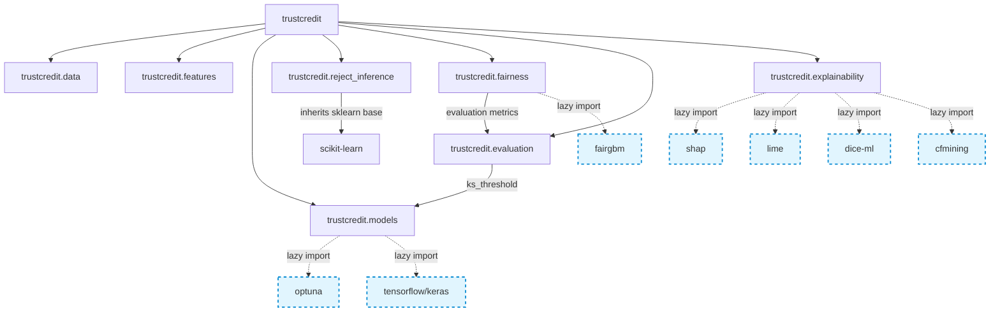

# TrustCredit Dependency Graph

The package features a clean modular structure. By migrating heavy library calls to lazy imports, we've untangled import-time dependencies so that minimal components can run without optional modules.

### Dependency Decoupling

- **Core Dependencies (Minimal Install)**:
  - `pandas` / `numpy` / `scikit-learn` / `matplotlib` / `gdown` / `chardet` / `xxhash`
  - Installs instantly and provides the dataset loader, preprocessors, metrics, and standard estimators.

- **Optional Features**:
  - `dev`: `pytest`, `black`, `ruff`, `jupyterlab`
  - `tuning`: `optuna` (loaded dynamically only during search)
  - `fairness`: `fairgbm` (loaded dynamically inside in-processing classifiers)
  - `xai`: `shap`, `lime`, `dice-ml` (loaded dynamically inside explainers)
